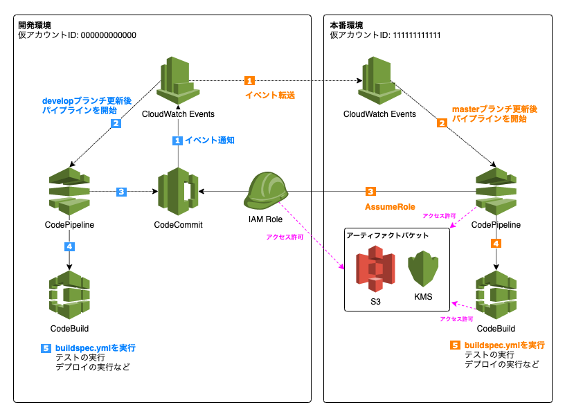

# Cross Account CI/CD Pipeline CDK Sample

クロスアカウントで動作する CI/CD Pipeline のサンプルです。



`develop` ブランチを更新すると、開発環境向けの CI/CD パイプラインが開始され、同環境にてリポジトリ内の `./buildspec.yml` が実行されます。

`master` ブランチを更新すると、本番環境向けの CI/CD パイプラインが開始され、本番環境で `./buildspec.yml` が実行されます。

アカウント間のイベント通知は `CloudWatch Events` の EventBus を介して行われます。開発環境にある CodeCommit リポジトリの `master` ブランチ更新のイベント通知を本番環境のパイプラインで受け取り、パイプラインの `source` アクションで、開発環境の CodeCommit に接続できるクロスアカウント用の IAM Role を AssumeRole して、本番環境から開発環境のリポジトリに接続します。

## 構築手順

### 1. リポジトリを作成

リポジトリは IaC の管理外にするため、その作成操作はマニュアルで行います。開発環境の AWS コンソール上で CodeCommit に移動してリポジトリを作成するか、開発環境の認証情報を設定した環境で以下のコマンドを実行してください。

```sh
aws codecommit create-repository --repository-name 'sample-repository'
```

### 2. アカウント設定を編集

`app.ts` を編集します。ここでは以下の設定でクロスアカウントの CI/CD 環境を構築します。実状に合わせて各値は変更してください。

| 項目                               | 値                  |
| ---------------------------------- | ------------------- |
| 開発環境のアカウント               | `000000000000`      |
| 開発環境のリージョン               | `ap-northeast-1`    |
| リポジトリ名                       | `sample-repository` |
| 開発環境の CICD を開始するブランチ | `develop`           |
| 本番環境のアカウント               | `111111111111`      |
| 本番環境のリージョン               | `ap-northeast-1`    |
| 本番環境の CICD を開始するブランチ | `master`            |

devPipelineStack に与えるパラメータを変更します。

```diff
const devPipeline = new devPipelineStack(app, `DevelopmentCICDPipelineStack`, {
  env: {
-   account: '************',
-   region: '**************'
+   account: '000000000000'
+   region: 'ap-northeast-1'
  },
- repositoryName: '************',
- branch: '*******',
+ repositoryName: 'sample-repository',
+ branch: 'develop',
  production: {
-   account: '************',
-   region: '**************'
+   account: '111111111111',
+   region: 'ap-northeast-1'
  }
```

prodPipelineStack に与えるパラメータを変更します。

```diff
new prodPipelineStack(app, `ProductionCICDPipelineStack`, {
  env: {
-   account: '************',
-   region: '**************'
+   account: '111111111111'
+   region: 'ap-northeast-1'
  },
  repositoryArn: devPipeline.repositoryArn,
- branch: '******',
+ branch: 'master',
  development: devPipeline
```

### 3. 認証情報プロファイルを設定します

`~/.aws/credentials` に開発環境と本番環境の認証情報を設定します。[AWS 認証情報ファイルと認証情報プロファイルの使用](https://docs.aws.amazon.com/ja_jp/sdk-for-php/v3/developer-guide/guide_credentials_profiles.html) を参考に、以下のように本番環境用の `dev` 、および開発環境用の `prod` プロファイルを設定してください。

```ini
[dev]
aws_access_key_id = AKIA000000EXAMPLE
aws_secret_access_key = ****************************************
[prod]
aws_access_key_id = AKIA111111EXAMPLE
aws_secret_access_key = ****************************************
```

### 4. 開発環境の CICD パイプラインを構築します

パッケージをインストールし、開発環境のアカウント ID とデプロイ先リージョンを指定することで CDK の [Bootstrapping](https://docs.aws.amazon.com/cdk/latest/guide/bootstrapping.html) を行い、開発環境の CICD パイプラインを構築します。

```sh
npm ci
npx cdk bootstrap 000000000000/ap-northeast-1 --profile dev
npx cdk deploy DevelopmentCICDPipelineStack --profile dev
```

### 5. 本番環境の CICD パイプラインを構築します

開発環境と同様に、本番環境の CICD パイプラインを構築します。

```sh
npx cdk bootstrap 111111111111/ap-northeast-1 --profile prod
npx cdk deploy ProductionCICDPipelineStack --profile prod
```

以上で環境の構築は完了です。リポジトリの `develop` ブランチを更新して開発環境のパイプラインが動作すること、`master` ブランチを更新して本番環境のパイプラインが動作することを確認してください。

## デプロイ時の動作の変更

デプロイ時の動作は `./stacks/dev-pipeline.ts` および `./stacks/prod-pipeline.ts` の下記の部分で定義されています。デフォルトではリポジトリの `./buildspec.yml` を実行し、環境変数には `SAMPLE_VARIABLE_KEY=sample_variable_value` を与え、実行時の権限は `PowerUserAccess` と `iam:*` を与えています。ユースケースに応じて、デプロイ時の権限、環境変数、そして `./buildspec.yml` の定義を変更してください。

```ts
const deployRole = new iam.Role(this, `${id}-deploy-role`, {
  assumedBy: new iam.ServicePrincipal('codebuild.amazonaws.com'),
  managedPolicies: [
    { managedPolicyArn: 'arn:aws:iam::aws:policy/PowerUserAccess' }
  ],
  inlinePolicies: {
    [`${id}-inline-policies`]: new iam.PolicyDocument({
      statements: [
        new iam.PolicyStatement({
          actions: ['iam:*'],
          resources: ['*']
        })
      ]
    })
  }
})

const deployDefinition = new codebuild.PipelineProject(this, `${id}-deploy`, {
  buildSpec: codebuild.BuildSpec.fromSourceFilename('./buildspec.yml'),
  role: deployRole,
  environment: {
    buildImage: codebuild.LinuxBuildImage.STANDARD_1_0,
    environmentVariables: {
      SAMPLE_VARIABLE_KEY: {
        type: codebuild.BuildEnvironmentVariableType.PLAINTEXT,
        value: 'sample_variable_value'
      }
    }
  }
})
```

## Security

See [CONTRIBUTING](CONTRIBUTING.md#security-issue-notifications) for more information.

## License

This library is licensed under the MIT-0 License. See the LICENSE file.
